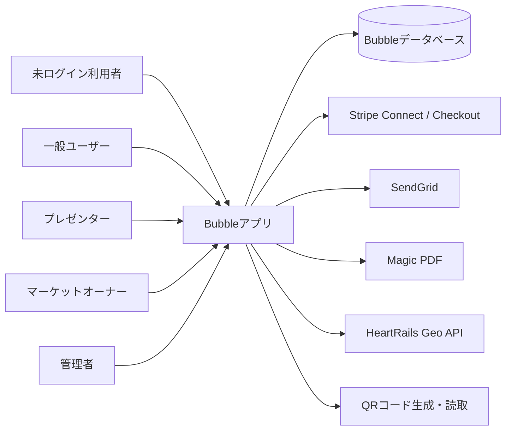

# プロダクト概要

## 1. 目的

ものコトMarketは、地域ごとのマーケットに所属するプレゼンターが商品・体験・地域情報を公開し、一般ユーザーが閲覧、購入、予約できるサービスです。マーケットオーナーは所属プレゼンターやコンテンツ、売上、サイト表示を管理し、サービス全体の管理者は複数マーケットを横断して運営します。

## 2. 利用者

| ロール | Bubble上の名称 | 主な利用目的 |
| --- | --- | --- |
| 購入者・参加者 | 一般ユーザー | マーケット閲覧、商品購入、イベント予約、履歴・通知確認 |
| 出品者 | プレゼンター | コンテンツ作成、予約・購入管理、売上確認、QRコード受付 |
| 地域運営者 | マーケットオーナー | プレゼンター・ユーザー・コンテンツ・売上・サイト設定の管理 |
| 全体運営者 | 管理者 | マーケット横断の管理、精算、通知、集荷先・離島情報の管理 |

ユーザーの役割は `UserInformation` の `user_type` で判定されます。`User` はログイン主体、`UserInformation` は氏名・住所・役割・取引関連のプロフィールとして分離されています。

## 3. 取り扱うコンテンツ

| 種別 | Bubble上の値 | 概要 |
| --- | --- | --- |
| コト | コト（イベントの開催） | 日時、定員、価格、申込期限、開催場所、キャンセルポリシーを持つ体験・イベント |
| モノ | モノ（商品の販売） | 価格、在庫、販売期間、配送または現地受取、配送料、定期購入を扱う商品 |
| ノート | ノート（観光名所などの紹介） | 地域情報や紹介記事。購入・予約を伴わない閲覧コンテンツ |

すべての種別は共通の `Content` を中心に管理され、開催枠や販売枠、予約・購入記録が関連づきます。

## 4. マーケットの単位

`market` が地域・運営単位です。マーケットごとに次を設定できます。

- 掲載コンテンツ、タグ、所属プレゼンター
- メイン画像、フッター画像、SEOタイトル・説明
- お知らせ
- 利用規約、プライバシーポリシー、運営会社情報、特定商取引法表記
- 利用可能な支払方法
- 手数料
- デモ環境か実環境かを分けるフラグ

ログインユーザーは `first_market`（初回選択）と `belongs_market`（現在所属）を持ち、マーケット切替ページから所属先を切り替える構成です。

## 5. 主要機能

- マーケット別のコンテンツ一覧、カテゴリ・タグ・開催日検索
- コンテンツ詳細表示
- 一般ユーザー、プレゼンター、マーケットオーナー、管理者の登録・ログイン
- メール認証コード、パスワード再設定
- モノの単品購入、カート購入、配送、現地受取、定期購入
- コトの予約、参加者情報、現金・クレジットカード決済
- 在庫・定員・受付期限・売切れ状態の管理
- 購入・予約履歴、キャンセル、領収書PDF
- プレゼンターによる出品、複製、公開・非公開、予約購入管理、売上管理
- QRコード発行・読み取りによる受付
- マーケットオーナーおよび管理者向け運営画面
- SendGridを利用した認証・購入・予約・キャンセル等の通知

## 6. システム構成

## 7. 用語

| 用語 | 意味 |
| --- | --- |
| マーケット | 地域・運営主体ごとのサイトおよびデータ境界 |
| プレゼンター | 商品、体験、地域情報を掲載する出品者 |
| Content | モノ・コト・ノートに共通する掲載情報 |
| Content_Koto | コトの具体的な開催枠 |
| content_Mono | モノの具体的な受取・販売枠 |
| Reserve | 予約または購入の取引記録 |
| Group_id | カートで同時購入したモノをまとめる番号 |
| demo_user / is demo | デモ利用者とデモデータを実データから分離するフラグ |

## 8. 対象範囲

本仕様書はBubbleのTestブランチに存在する静的なアプリ構成を対象とします。次は別途確認が必要です。

- TestとLiveの差分
- Bubbleデータベース内の実レコードとデータ量
- Stripe、SendGrid等の外部管理画面にある本番設定
- 実ブラウザ上でのレスポンシブ表示、メール本文、決済完了後の実動作

