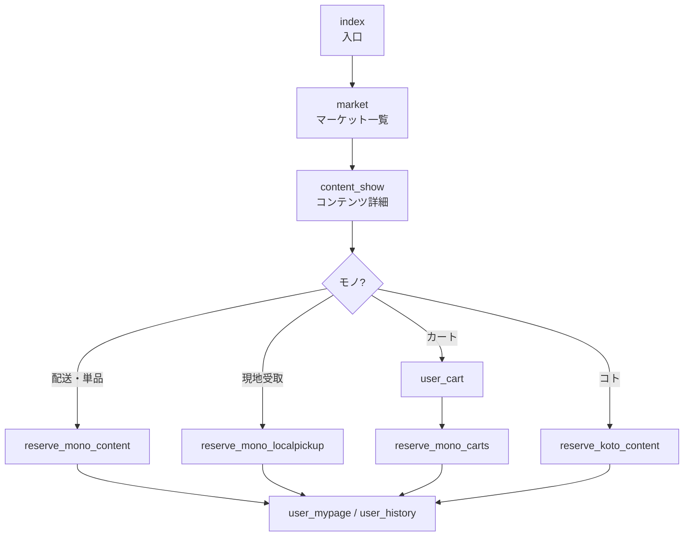

# 画面・権限

## 1. 主な利用導線

## 2. 一般公開・一般ユーザー向けページ

| ページ | 役割 | 主な補足 |
| --- | --- | --- |
| `index` | アプリの入口 | ログイン状態に応じて遷移を制御 |
| `market` | マーケットのトップ・コンテンツ一覧 | `market` をページデータとして受け取り、カテゴリ、タグ、開催日、販売方法で絞り込み |
| `content_show` | コンテンツ詳細 | `Content` を受け取り、モノ・コト・ノート別の表示へ分岐 |
| `login` | 共通ログイン | 登録、ログイン、パスワード再設定の入口 |
| `user_auth` | 一般ユーザー登録・認証 | 新規登録、認証コード、アカウント情報登録 |
| `reset_pw` | パスワード再設定 | リセットメールから新パスワードを設定 |
| `change-usermarket` | マーケット切替 | 現在所属するマーケットを更新 |
| `user_cart` | カート | Active、Ordered、SoldOutの状態を扱う |
| `reserve_mono_content` | モノの単品購入 | 配送販売の購入情報入力、最終確認、確定 |
| `reserve_mono_carts` | カート一括購入 | 配送先と購入内容をまとめて確定 |
| `reserve_mono_localpickup` | モノの現地受取 | 受取日時等を指定して確定 |
| `reserve_koto_content` | コトの予約 | 人数、参加者、支払方法等を指定して確定 |
| `user_mypage` | 一般ユーザーのマイページ | 購入・予約履歴、アカウント情報の入口 |
| `user_notification` | お知らせ一覧 | 既読管理を含む通知表示 |
| `receipt` | モノの領収書表示 | `Group_id` 単位のPDF生成元画面 |
| `receipt_koto` | コトの領収書表示 | `Content_KotoReserve` 単位のPDF生成元画面 |
| `contact` | お問い合わせ | 問い合わせ保存とメール送信 |
| `info_company` | 運営会社情報 | マーケットごとの内容を表示 |
| `info_legal` | 特定商取引法表記 | マーケットごとの内容を表示 |
| `info_privacy-policy` | プライバシーポリシー | マーケットごとの内容を表示 |
| `info_terms-of-use` | 利用規約 | マーケットごとの内容を表示 |
| `monokoto_privacy_policy` | サービス共通プライバシーポリシー | 共通文書 |
| `404` | Not Found | トップへ戻る導線 |

## 3. プレゼンター向けページ

| ページ | 役割 | 主な機能 |
| --- | --- | --- |
| `presenter_auth` | プレゼンター登録・ログイン | 認証コード、プロフィール、銀行情報、Stripeアカウント作成 |
| `presenter` | コンテンツ管理の入口 | ログイン・役割確認後、管理機能を表示 |
| `presenter_mypage` | プレゼンターのマイページ | 予約・購入履歴等への導線 |

主要な管理機能は再利用可能エレメントで構成されています。

- `presenter_contents`: モノ・コト・ノートの新規作成、編集、複製、プレビュー、公開
- `presenter_reserve_list`: 予約・購入一覧、配送状況、追跡コード、詳細表示
- `presenter_SalesManagement`: 売上・入金ステータス管理
- `presenter_qrcode`: カメラ起動、QRコード読取、モノ・コトの受付処理
- `presenter_header`: 管理メニュー、アカウント、ログアウト

## 4. マーケットオーナー向けページ

| ページ | 役割 |
| --- | --- |
| `marketowner_auth` | マーケットオーナー登録・ログイン、Stripe接続 |
| `marketowner` | マーケット運営画面 |

運営画面の機能は次の再利用可能エレメントに分かれています。

- `marketowner1_presenter`: 所属プレゼンター管理
- `marketowner2_contents`: コンテンツ管理
- `marketowner3_reserved`: 予約・購入管理
- `marketowner4_sales`: 売上管理
- `marketowner5_SiteSetting`: 画像、支払方法、お知らせ、ユーザー、タグ等のサイト設定
- `marketowner6_setting`: 規約・会社情報等の設定
- `marketowner7_accountinfo`: アカウント情報
- `marketowner8_stripeaccount`: Stripe Connect設定
- `marketowner_userlist`: 一般ユーザー一覧・履歴

## 5. 管理者向けページ

| ページ | 役割 |
| --- | --- |
| `admin_auth` | 管理者ログイン・パスワード再設定 |
| `admin_mypage` | 全体管理画面 |
| `99_admin_presenter_create` | 管理者によるプレゼンター作成用画面 |

管理領域には次の機能があります。

- マーケットオーナー、プレゼンター、一般ユーザーの管理
- コンテンツ、予約・購入、売上、精算の管理
- お知らせ、規約、アカウント情報の管理
- 集荷先情報、離島リストの管理

## 6. 補助・検証用ページ

| ページ | 用途 |
| --- | --- |
| `99_test_function` | 機能検証用。一般公開導線からは分離して扱うべきページ |

## 7. 共通UI

| 再利用可能エレメント | 役割 |
| --- | --- |
| `user_header` / `footer` | 一般画面のナビゲーション、規約・問い合わせ等への導線 |
| `content_card` | 一覧上のコンテンツカードと遷移 |
| `content_mono_show` / `content_koto_show` / `content_note_show` | 種別ごとの詳細表示 |
| `user_history` | 一般ユーザーの購入・予約履歴、キャンセル、領収書 |
| `shipping_info` | 配送先情報表示 |
| `notification` | 通知表示 |
| `account_*` | 基本情報、銀行口座、配送料、メール、パスワード、退会等のアカウント設定 |
| `loading` | ローディング表示 |

## 8. アクセス制御の現状

- ページロード時またはログイン状態イベントで、未ログイン・ロール不一致ユーザーを別ページへ遷移させる構成があります。
- 管理ページは `user_type` とログイン状態に依存します。
- ページ側の遷移制御だけでなく、データ側のPrivacy Rulesが最終的なアクセス境界になります。
- 実ブラウザで、URL直入力、ログアウト状態、異なるロール、デモユーザーの各ケースを確認する必要があります。

