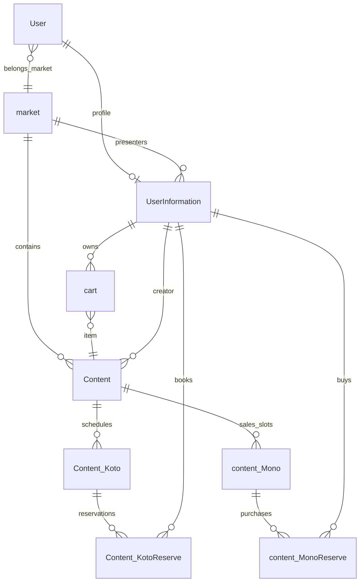

# データモデル

## 1. 主要な関連

## 2. アカウント・所属

### `User`

Bubble標準のログインユーザーです。

| 主なフィールド | 型 | 用途 |
| --- | --- | --- |
| `demo_user` | yes/no | デモデータだけを参照するユーザーか |
| `test_user` | yes/no | テスト利用者か |
| `authenticated` | yes/no | メール等の認証完了状態 |
| `stripe_account_id` | text | Stripe Connectアカウント識別子 |
| `first_market` | market | 初回選択マーケット |
| `belongs_market` | market | 現在所属するマーケット |
| `userInformation` | UserInformation | プロフィール |

### `UserInformation`

氏名、連絡先、住所、ロールと取引関連を保持します。主なフィールドは `user_name`、`tel`、`post_code`、`preficture`、`city`、`other_address`、`user_type`、`presenter_nickname`、`invoice_number`、`bankinfo`、`cart(s)`、`create_content`、`Content_MonoReserve`、`Content_koto_Reserve` です。退会状態は `leave` と `leave_date` で管理します。

### その他

| データタイプ | 用途 |
| --- | --- |
| `UserInformation_bankinfo` | 金融機関、支店、口座種別、番号、名義等の振込先情報 |
| `stripe` | Stripe Connectの接続状態、銀行末尾情報、入金・決済有効状態 |
| `user_SignupCodeHistory` | メール認証コードとメールアドレス |

## 3. マーケット・コンテンツ

### `market`

地域マーケットの表示・運営設定を保持します。`contents`、`presenters`、`market_tag` に加え、SEO、画像、お知らせ、利用規約、プライバシーポリシー、会社情報、特商法表記、支払方法、手数料を管理します。

### `Content`

3種のコンテンツに共通する中心データです。

| 区分 | 主なフィールド |
| --- | --- |
| 共通 | `01_category`、`02_common_name`、`03_common_description`、`04_common_image`、`05_common_InfoDescription`、`06_common_InfoAttention`、`07_common_URL`、`08_common_AreaName` |
| 所属・作成者 | `market`、`market_tags`、`creator_UserInfo` |
| 公開制御 | `28_draft`、`priority`、`sold_out`、`duplicate`、`is demo` |
| モノ | `09_mono_price`、`10_mono_stock`、`11_mono_SalesPeriod`、`13_mono_cancel_policy`、`29_mono_pickup_startdate`、`30_mono_pickup_enddate`、`32_mono_method_status`、`33_tax_rate`、`34_shipping_fee` |
| コト | `14_koto_note_postcode`〜`25_koto_RemoveDate`、`26_koto_contents` |
| 定期購入 | `subscription`、`subscription_price`、`stripe_PlanID` |
| 関連取引 | `content_Monos`、`content_MonoReserve`、一時データ一覧 |

### 開催・販売枠

| データタイプ | 用途 | 主なフィールド |
| --- | --- | --- |
| `Content_Koto` | コトの開催枠 | 開催日、開始・終了日時、時刻、価格、定員、応募可能人数、申込期限、予約一覧、デモ区分 |
| `content_Mono` | モノの販売・受取枠 | 日付、時刻、価格、在庫、売切れ、期限、購入一覧 |
| `content_KotoTemporary` | コト枠作成時の一時データ | 時刻、価格、定員 |
| `ContentMonoTemporary` | モノ枠作成時の一時データ | 時刻、価格、在庫 |

### 関連マスタ

| データタイプ | 用途 |
| --- | --- |
| `market_tag` | マーケット別検索タグ |
| `Prefecture` | 都道府県名、表示順、地域区分 |
| `aria` | 地域別配送料、全国一律料金、送料無料設定 |
| `island_data` | 離島名と郵便番号 |
| `legal` | 特定商取引法に基づく表示項目 |

## 4. 取引

### `cart`

一般ユーザーのモノ購入候補です。`content`、`content_mono`、`quantity`、`subtotal`、`status`、`userinfo`、`create_presenter`、`mono_method_status` を持ちます。

### `content_MonoReserve`

モノ1件の購入記録です。

- 商品、販売枠、購入者、数量、合計金額、税率
- 配送先氏名、電話、郵便番号、都道府県、市区町村、番地等
- 送料、送料調整額、配送会社、追跡コード
- 予約状態、発送・引渡状態、キャンセル理由
- `Group_id`、領収書URL、QRコード
- 定期購入ID、次回処理のスケジュールID

### `Content_KotoReserve`

コト1件の予約記録です。開催枠、予約者、参加人数・参加者、合計金額、手数料、決済方法・状態、予約状態、受付状態、キャンセル理由、要望、Stripe決済識別子、領収書URL、QRコードを保持します。

### その他の取引データ

| データタイプ | 用途 |
| --- | --- |
| `cart_PaymentHistory` | カート決済をプレゼンター・購入者・マーケットオーナー単位で集計した履歴 |
| `subscription_mono` | 定期購入契約、顧客・契約・スケジュール識別子、購入履歴 |
| `collection` | 配送会社・集荷先関連の名称、リンク、追跡URL、既定設定 |

## 5. 情報・補助データ

| データタイプ | 用途 |
| --- | --- |
| `Notification` | タイトル、本文、既読ユーザー一覧 |
| `contact` | 問い合わせの氏名、メール、件名、本文、宛先、送信者 |
| `document` | 生成・保管するファイルURL |

## 6. 主要Option set

| Option set | 有効な主な値 |
| --- | --- |
| `user_type` | 一般ユーザー、プレゼンター、マーケットオーナー、管理者 |
| `Content_category` | コト（イベントの開催）、モノ（商品の販売）、ノート（観光名所などの紹介） |
| `content_category(search)` | すべて、モノ、コト、ノート |
| `mono_method_status` | 配送販売、現地受取 |
| `cart_status` | Active、Ordered、SoldOut |
| `reserve_status` | すべて、入金済、キャンセル済、未払い |
| `content_status` | 未発送、発送済、キャンセル済、終了、引渡済み |
| `Content_PaymentMethod` | クレジットカード、現金 |
| `payment_status` | お支払い済み、当日現金でお支払い |
| `market_PaymentMethod` | 現地払いとクレジットカード、現地払いのみ、クレジットカードのみ |
| `Shipping_fee` | エリア別料金、全国一律料金 |
| `Tax_rate` | 消費税8%、消費税10% |
| `Content_deadline` | 受取3日前、受取2日前、受取1日前 |
| `koto_CancelPolicy` | 72時間前、48時間前、24時間前まで可、不可 |
| `mono_CancelPolicy` | キャンセル不可 |
| `aria_list` | 北海道、東北、関東、信越、北陸、東海、近畿、中国、四国、九州、沖縄／離島 |

メニュー、タブ、検索ソート、登録ステップ、曜日、銀行口座種別もOption setで管理されています。

## 7. Privacy Rulesの現状

### 明示的に制御されている主なデータ

- `User`: 全員向けにはメール、プロフィール、所属マーケット等の一部だけを許可し、本人は全項目を参照可能。
- `Content`、`Content_Koto`、`market`: `is demo` とユーザーの `demo_user` を照合してデモ・実データを分離。
- `content_Mono`: 公開参照用の一部フィールドと、作成者による編集権限を設定。
- `UserInformation_bankinfo`、`stripe`: 本人向けルールあり。

### 要確認

- `UserInformation`、`cart`、`Notification`、`contact`、`collection`、`legal`、`market_tag`、`subscription_mono` 等には明示的なPrivacy Ruleがありません。
- `content_MonoReserve` と `Content_KotoReserve` の `everyone` ルールは全項目の閲覧・検索・添付参照を許可しています。住所、電話、購入者、決済関連情報を含むため、公開範囲が意図どおりか最優先で確認が必要です。
- データタイプの新規作成時に既定で非公開にする設定は無効です。新規データタイプ追加時はPrivacy Rulesの同時設定が必要です。

