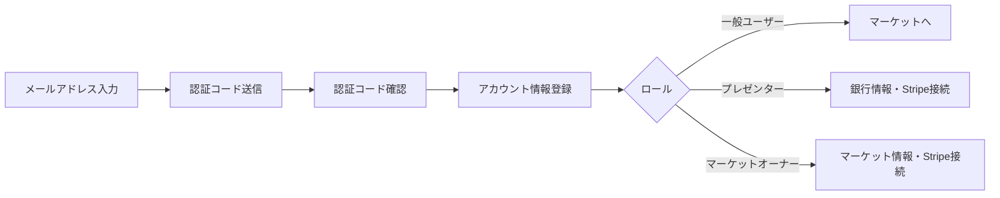
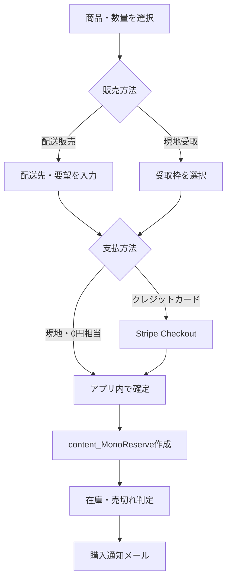
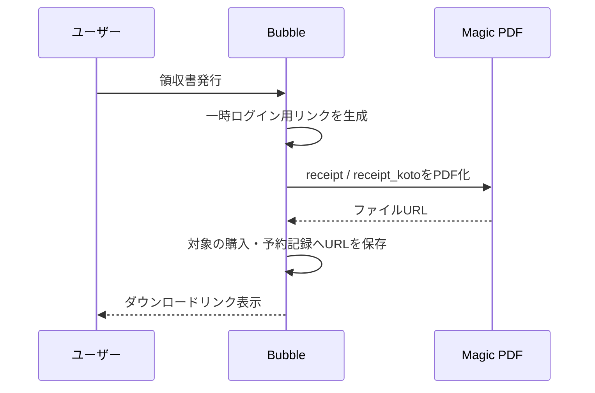

# ワークフロー

## 1. 認証・登録

一般ユーザー、プレゼンター、マーケットオーナーで登録画面を分けています。基本フローは次のとおりです。

- 認証コード送信はBackend workflow `authentication-code` を利用します。
- 認証コード履歴は一定時間後に削除する処理があります。
- ログインURL作成、マーケットオーナー向けログインURL作成、パスワード再設定メールをBackend workflowで送信します。
- ページロード・ログイン状態イベントでロール別の遷移を行います。

## 2. コンテンツ作成・公開

`presenter_contents` が主な編集画面です。

1. プレゼンターがモノ・コト・ノートを選択します。
2. 共通情報と種別固有情報を入力します。
3. コトの開催日時・価格・定員、またはモノの販売日時・価格・在庫を一時データに追加します。
4. プレビューで表示を確認します。
5. 公開時に `Content` と開催・販売枠を作成または更新します。
6. 複製したコンテンツは `duplicate` で管理され、編集後に通常状態へ戻ります。

大量の開催・販売枠は再帰Backend workflowで生成します。

- `create_content_koto_temp1` / `temp2` / `temp_oneday`
- `create_content_mono_temp1` / `temp2` / `temp_oneday`
- `create_ContentKoto1` / `create_ContentKoto2` / `create_ContentKoto_oneday`
- `content_add_content_koto` / `create_contentkoto3`

## 3. モノの単品購入

- 購入記録を商品、販売枠、購入者プロフィールに関連づけます。
- 予約状態は入金済・未払い・キャンセル済等で管理します。
- 残在庫が0以下になると売切れ処理と通知を実行します。
- 定期購入では `subscription_mono` を作成し、`create_monobuyer` を2か月後に再スケジュールする構成があります。

## 4. カート購入

`reserve_mono_carts` から非公開Backend workflow `cart_checkout_recursive` を開始します。

1. Activeなカート項目と配送先、送料、送料調整額、`Group_id` を渡します。
2. カートの各項目について `content_MonoReserve` を作成します。
3. 商品・販売枠・購入者へ購入記録を追加します。
4. カート状態をOrderedへ更新します。
5. 各項目の在庫を判定し、必要なら売切れ処理を実行します。
6. 最終項目でカート購入完了メールを送ります。

`Group_id` は一括購入の領収書と取引グループ化に使われます。

## 5. コトの予約

`reserve_koto_content` で開催枠、人数、参加者、要望、支払方法を確認し、`Content_KotoReserve` を作成します。

- 定員と応募可能人数を参照して受付可否を判定します。
- クレジットカードまたは現金の支払状態を記録します。
- 予約記録を開催枠とユーザープロフィールへ関連づけます。
- 予約完了メールを送信します。
- キャンセルポリシーに応じて、ユーザー履歴からキャンセル処理とメール通知を行います。
- QRコードを発行し、プレゼンターの受付画面で読み取ります。

## 6. 配送・受付・キャンセル

- プレゼンターは購入記録に配送会社と追跡コードを設定し、状態を未発送から発送済へ変更できます。
- 現地受取はQRコード等で引渡済みに更新します。
- コトはQRコード読取後に終了状態へ更新します。
- モノ、定期購入、コトに個別のキャンセルメールがあります。
- ステータス変更メール、売切れ通知もBackend workflowで送信します。

## 7. 領収書PDF

- モノは `Group_id` 単位、コトは予約ID単位です。
- PDF生成完了後、対象記録の `receipt_url` を更新します。

## 8. メール通知一覧

SendGridを利用するBackend workflowは次の用途に分かれます。

- 認証コード
- 問い合わせ
- ログインURL、マーケットオーナー向けログインURL
- パスワード再設定
- コト予約完了、コトキャンセル
- モノ購入完了、カート購入完了
- モノキャンセル、定期購入キャンセル
- モノの状態変更
- 売切れ通知

## 9. 管理・保守用Backend workflow

管理用として、初期マーケット設定、税率追加、購入記録へのGroup ID追加、コンテンツ販売方法変更、テストユーザー状態変更等の一括処理があります。通常運用フローと分離し、実行前に対象件数とTest／Liveを確認する必要があります。

## 10. エラー処理の現状

- Stripe決済エラー、Stripe口座変更、Stripeアカウント削除用の公開Backend workflowがあります。
- 画面上の入力条件やOnly whenによるガードは多数ありますが、本仕様書作成時点では全分岐の実ブラウザ検証は未実施です。
- 冪等性、二重クリック、Stripe Webhook再送、再帰処理の途中失敗時に重複取引が発生しないかは追加試験が必要です。

